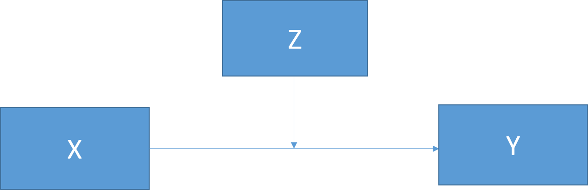
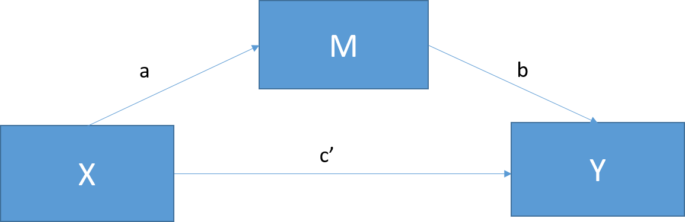
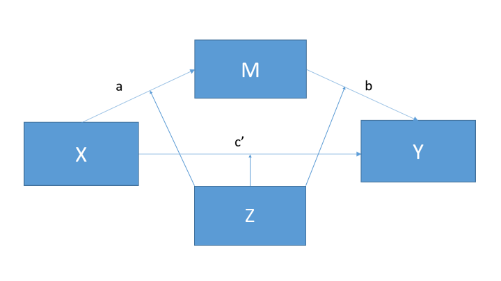

```{r setup, include=FALSE}
knitr::opts_chunk$set(echo = TRUE)
```

## Moderation
Basic Moderation Model


Moderation tests the influence of a third variable (Z) on the relationship between X to Y
X -> Y (depending on Z)

## Mediation

Mediation tests a hypothetical causal chain where the effect of one variable (X) on another variable (Y) is mediated, or explained, by a third variable (M)
X -> M -> Y




## What is moderated mediation?


Moderated mediation tests the influence of a fourth (or more) variable on the mediated relationship between X and Y

The effect of the mediator is moderated by another variable
X -> M -> Y (depending on Z)

The moderation can occur on any and all paths in the mediation model (e.g., a path, b path, c path, or any combination of the three)

### Practical definition and example
The more time one spends in graduate school, the more job offers they have when they graduate
This relationship is explained by increased publications (i.e., the more time spent in grad school, the more publications one has, and the more publications one has, the more job offers they get)

However, this causal chain may only work for people who spend their time in graduate school wisely (i.e., spend time with Professor Demos)

*How does spending time with Professor Demos impact the causal chain between time spent in graduate school, publications, and job offers?* Let’s find out…

## Moderated mediation data example

### Data
We are going to simulate a dataset that measured the following:

X = Time spent in graduate school (we will change the name to “time” when we create the data frame)
Z = Time spent (hours per week) with Professor Demos in class or in office hours
M = Number of publications in grad school
Y = Number of job offers


We are intentionally creating a moderated mediation effect here and we do so below by setting the relationships (the paths) between our causal chain variables and setting the relationships for our interaction terms

```{r, warning = F, message = F}
library(tidyverse)
library(psych)
library(mediation)
set.seed(42) #This makes sure that everyone gets the same numbers generated through rnorm function

a1 = -.59 #Set the path a1 strength (effect of X on M)

a2 = -.17 #Set path a2 strength (effect of Z on M)

a3 = .29 #Set path a3 strength (interaction between X and Z on M)

b = .59 #Set path b strength (effect of M on Y)

cdash1 = .27 #Set path c'1 strength (effect of X on Y)

cdash2 = .01 #Set path c'2 strength (effect of Z on Y)

cdash3 = -.01 #Set path c'3 strength (interaction betwee X and Z on Y)
```

Here we are creating the values of our variables for each subject

```{r}
n <- 200 #Set sample size

X <- rnorm(n, 7, 1) #IV: Time spent in grad school (M = 7, SD = 1)

Z <- rnorm(n, 5, 1) #Moderator: Time spent (hours per week) with Professor Demos in class or in office hours (M = 5, SD = 1)

M <- a1*X + a2*Z + a3*X*Z + rnorm(n, 0, .1) #Mediator: Number of publications in grad school
#The mediator variable is created as a function of the IV, moderator, and their interaction with some random noise thrown in the mix

Y <- cdash1*X + cdash2*Z + cdash3*X*Z + b*M + rnorm(n, 0, .1) #DV: Number of job offers
#Similar to the mediator, the DV is a function of the IV, moderator, their interaction, and the mediator with some random noise thrown in the mix
```

Now we put it all together and make our data frame

```{r}
Success.ModMed <- data.frame(jobs = Y, time = X, pubs = M, alex = Z) #Build our data frame and give it recognizable variable names
```

### Examine the dataset and prepare for regression analyses

```{R}
str(Success.ModMed) #Examine the structure of the dataset

```
Because we have interaction terms in our regression analyses, we need to mean center our IV and Moderator (Z)

```{r}
Success.ModMed$time.c <- scale(Success.ModMed$time, center = TRUE, scale = FALSE)[,] #Scale returns a matrix so we have to make it a vector by indexing one column

Success.ModMed$alex.c <- scale(Success.ModMed$alex, center = TRUE, scale = FALSE)[,]
```

## Moderated mediation analyses using “mediation” package
We will first create two regression models, one looking at the effect of our IVs (time spent in grad school, time spent with Alex, and their interaction) on our mediator (number of publications), and one looking at the effect of our IVs and mediator on our DV (number of job offers).

Next, we will examine the influence of our moderating variable (time spent with Alex) on the mediation effect of time spent in grad school on number of job offers, through number of publications. To do this, we will examine the mediation effect for those who spend a lot of time with Alex versus those who spend little time with Alex.

### Create the necessary regression models
We need two regression models to use the mediation package

One model specifies the effect of our IV (time spent in grad school) on our Mediator (number of publications) [and in our case, our moderator (time spent with Alex) and the interaction]

The other model specifies the effect of the IV (time spent in grad school) and Mediator (number of publications) (and possibly moderator as well) on our DV (number of job offers)

```{r}
Mod.Med.Model.1<-lm(pubs ~ time.c*alex.c, data = Success.ModMed) #This model predicts number of publications from time spent in grad school, time spent with alex, and the interaction between the two

summary(Mod.Med.Model.1)
```

Significant main effect of time spent in grad school on number of publications
Significant main effect of time spent with Alex on number of publications
Significant interaction between time spent in grad school and time spent with Alex on number of publications

```{r}
Mod.Med.Model.2<-lm(jobs ~ time.c*alex.c + pubs, data = Success.ModMed) #This model predicts number of job offers from time spent in grad school, time spent with alex, number of publications, and the interaction between time spent in grad school and time spent with alex

summary(Mod.Med.Model.2)
```

Significant main effect of time spent in grad school on number of job offers
No effect of time spent with Alex on number of job offers
Significant main effect of number of publications on number of job offers
No interaction between time spent in grad school and time spent with Alex on number of job offers

### Examine the effect of our moderator on the mediation effect
In this mediation  we list the moderator as a covariate and set the levels to what we want

We can use the +/- 1SD from the mean (or another value that is theoretically important)

This allows us to view impact of the moderator on the direct and indirect effects

Lets look at grad students who spend little time with Alex first

```{r, cache = T}
#Moderator must be in both models for mediate to work.
low.alex<-mean(Success.ModMed$alex.c)-sd(Success.ModMed$alex.c) #Sets our level for 1 SD below mean of alex.c

Mod.Med.LowAlex <- mediation::mediate(Mod.Med.Model.1, Mod.Med.Model.2,    
                           covariates = list(alex.c = low.alex), boot = TRUE,   
                           boot.ci.type = "bca", sims = 1000, treat="time.c", mediator="pubs")
```
The mediate function can handle different types of CI estimation. Here we are asking for bias-corrected and accelerated confidence intervals because this gives us more accurate confident interval estimates and corrects for deviation from normality 

We also have to specify our IV (treat) and Mediator(pubs)

ACME: Average Causal Mediation Effect [total effect - direct effect]
ADE: Average Direct Effect [total effect - indirect effect]
Total Effect: Direct (ADE) + Indirect (ACME)
Prop. Mediated: Conceptually ACME / Total effect (This tells us how much of the total effect our indirect effect is “explaining”)

```{r}
summary(Mod.Med.LowAlex)
```

```{r}
plot(Mod.Med.LowAlex, xlim = 0:1)
```

Significant direct effect of time spent in grad school on job offers (for those who don’t spend a lot of time with Alex)
Significant indirect effect of time spent in grad school on job offers through publications (for those who don’t spend a lot of time with Alex)


### Now let’s look at grad students who spend a lot of time with Alex

```{r, cache = T}
high.alex<-mean(Success.ModMed$alex.c)+sd(Success.ModMed$alex.c)

Mod.Med.HighAlex <- mediation::mediate(Mod.Med.Model.1, Mod.Med.Model.2,   
                            covariates = list(alex.c = high.alex), boot = TRUE,     
                            boot.ci.type = "bca", sims = 1000, treat="time.c", mediator="pubs")

summary(Mod.Med.HighAlex)   
```

```{r}
plot(Mod.Med.HighAlex, xlim = 0:1)
```

Significant direct effect of time spent in grad school on job offers (for those who spend a lot of time with Alex)

Significant indirect effect of time spent in grad school on job offers through publications (for those who spend a lot of time with Alex)

The indirect effect looks larger for those who spend a lot of time with Alex compared to those who don’t, but we can test this to make sure

The following code tests whether the difference between indirect effects at each level of the moderator is significantly different from zero

```{r, cache = T}
Mod.Med.TestAlex <- mediation::mediate(Mod.Med.Model.1, Mod.Med.Model.2, boot = TRUE,  
                            boot.ci.type = "bca", sims = 1000, treat="time.c", mediator="pubs")   #We don't specify anything about the moderator in this code yet

test.modmed(Mod.Med.TestAlex, covariates.1 = list(alex.c = low.alex),   
            covariates.2 = list(alex.c = high.alex), sims = 10) #Here we specify both levels of the moderator that we want to test
```

We can see that the indirect effects are significantly different such that the effect of spending time in graduate school on getting job offers through publications is stronger for those students who spend a lot of time with Alex compared to those who do not

There is no different in the size of the direct effects, however

##Strengths and limitations of “mediation” package
Code is fairly straightforward and makes intuitive sense in how to specify levels of moderators
Compatible with many types of regression, including linear, glm, ordered, censored, quantile, GAM, and survival

Limited in the types of moderated mediation models it can estimate

Must include moderator in both models (meaning that you cannot model two of the most popular moderated mediation models, Hayes’ Model 7 and Model 14)

Cannot handle highly complex mediational models with several causally dependent mediators and moderators

However, structural equation model (SEM) programs can model more complex models, which we turn to next

## Moderated mediation analyses using lavaan

In “lavaan” we specify all regressions and relationships between our variables in one object

We can specify the effects we want to see in our output (e.g., direct, indirect, etc.)

We can also compute means and standard deviations for use in simple slopes analyses

After specifying all the necessary components, we fit the model using an SEM function

```{r}
library(lavaan)

Mod.Med.Lavaan <- '
#Regressions
#These are the same regression equations from our previous example
#Except in this code we are naming the coefficients that are produced from the regression equations
#E.g., the regression coefficient for the effect of time on pubs is named "a1"
pubs ~ a1*time.c + a2*alex.c + a3*time.c:alex.c
jobs ~ cdash1*time.c + cdash2*alex.c + cdash3*time.c:alex.c + b1*pubs

#Mean of centered alex (for use in simple slopes)
#This is making a coefficient labeled "alex.c.mean" which equals the intercept because of the "1"
#(Y~1) gives you the intercept, which is the mean for our alex.c variable
alex.c ~ alex.c.mean*1

#Variance of centered alex (for use in simple slopes)
#This is making a coefficient labeled "alex.c.var" which equals the variance because of the "~~"
#Two tildes separating the same variable gives you the variance
alex.c ~~ alex.c.var*alex.c

#Indirect effects conditional on moderator (a1 + a3*ModValue)*b1
indirect.SDbelow := (a1 + a3*(alex.c.mean-sqrt(alex.c.var)))*b1
indirect.SDabove := (a1 + a3*(alex.c.mean+sqrt(alex.c.var)))*b1

#Direct effects conditional on moderator (cdash1 + cdash3*ModValue)
#We have to do it this way because you cannot call the mean and sd functions in lavaan package
direct.SDbelow := cdash1 + cdash3*(alex.c.mean-sqrt(alex.c.var)) 
direct.SDabove := cdash1 + cdash3*(alex.c.mean+sqrt(alex.c.var))

#Total effects conditional on moderator
total.SDbelow := direct.SDbelow + indirect.SDbelow
total.SDabove := direct.SDabove + indirect.SDabove

#Proportion mediated conditional on moderator
#To match the output of "mediate" package
prop.mediated.SDbelow := indirect.SDbelow / total.SDbelow
prop.mediated.SDabove := indirect.SDabove / total.SDabove

#Index of moderated mediation
#An alternative way of testing if conditional indirect effects are significantly different from each other
index.mod.med := a3*b1
'
```

Now we take the specified models and all of the effects we want to estimate and run them through the SEM function. The SEM function allows a completely user-defined model to be fit to the data, like our specifically defined moderated mediation model (the SEM function was designed to fit structural equation models, but can also fit “regular” regression models as well).

```{r, cache = T}
#Fit model
Mod.Med.SEM <- sem(model = Mod.Med.Lavaan,
                   data = Success.ModMed,
                   se = "bootstrap",
                   bootstrap = 1000)
#Fit measures
summary(Mod.Med.SEM,
        fit.measures = FALSE,
        standardize = TRUE,
        rsquare = TRUE)
```

The first chunk of the output show fit indices related to SEM (not really applicable for our purposes)
The second part of the output shows our regression formulas

The end of the output shows the specified direct, indirect, total, proportion mediated effects

We can also call for bootstrapped confidence interval parameter estimates of all of our effects

```{r}
#Bootstraps
parameterEstimates(Mod.Med.SEM,
                   boot.ci.type = "bca.simple",
                   level = .95, ci = TRUE,
                   standardized = FALSE)[c(19:27),c(4:10)] #We index the matrix to only display columns we are interested in
```

Our estimates and confidence intervals are almost identical to the “mediation” package estimates
The difference is most likely a result of bootstrap estimation differences (e.g., lavaan uses bias-corrected but not accelerated bootstrapping for their confidence intervals)

### Strengths and limitations of “lavaan” package
Extremely customizable

Can also model latent variables if your measurement model requires it

A lot of up front coding required meaning you kind of need to know exactly what you’re looking for in your model


### Sources
https://nmmichalak.github.io/nicholas_michalak/blog_entries/2018/nrg01/nrg01.html

https://ademos.people.uic.edu/Chapter15.html

Hayes, A. F. (2013). Introduction to mediation, moderation, and conditional process analysis: A regression-based approach. New York: The Guilford Press.

Michalak, N. (2016, July 29). Reproducing Hayes’ PROCESS models’ results in R. Retrieved from https://nickmichalak.blogspot.com/2016/07/reproducing-hayess-process-models.html

Rosseel, Y. (2017, February 24). Package ‘lavaan’. Retrieved from https://cran.r-project.org/web/packages/lavaan/lavaan.pdf

Sales, A. C. (2017). Review: Mediation package in R. Journal of Educational and Behavioral Statistics, 42, 1, 69-84.

Tingley, D., Yamamoto, T., Hirose, K., Keele, L., & Imai, K. (2014). Mediation: R package for causal mediation analysis

MacKinnon, D. P. (2008). Introduction to statistical mediation analysis. New York, NY: Lawrence Erlbaum Associates.

Revelle, W. (2017) How to use the psych package for mediation/moderation/regression analysis.

Rosseel, Y. (2012). Lavaan: An R package for structural equation modeling and more. Version 0.5–12 (BETA). Journal of statistical software, 48(2), 1-36.

Rucker, D. D., Preacher, K. J., Tormala, Z. L., & Petty, R. E. (2011). Mediation analysis in social psychology: Current practices and new recommendations. Social and Personality Psychology Compass, 5(6), 359-371.