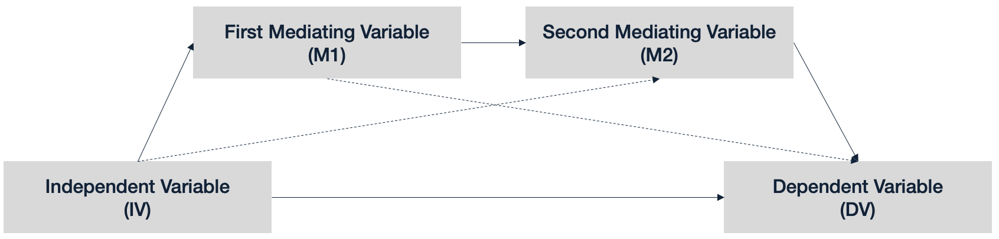

```{r setup, include=FALSE}
knitr::opts_chunk$set(echo = TRUE)
```

## Serial Mediation




In our serial mediation. There are an independent variable and a dependent variable, and two mediators. The two mediators do an increasingly better job at predicting the dependent variable. The schematic above depicts how it works. In everyday research, one should deduct this serial mediation model from theory or previous findings.

## Simulating the data

Before we start with the analysis, let's simulate our data. Above, we wrote that the closer the variable is to the dependent variable (DV), the better it is at predicting the DV. This is reflected in our simulated data.

```{r}
set.seed(1234) # enter this command to get the same "random" results as I do here.
iv <- rnorm(n = 1000, mean = 50, sd = 10)
m1 <- .6 * rnorm(n = 1000, mean = 50, sd = 10) + .4 * iv
m2 <- .6 * rnorm(n = 1000, mean = 50, sd = 10) + .4 * m1
dv <- .6 * rnorm(n = 1000, mean = 50, sd = 10) + .4 * m2
cv1 <- rnorm(n = 1000, mean = 50, sd = 10)
cv2 <- rnorm(n = 1000, mean = 50, sd = 10)
```

As you can see, the independent variable (IV) is 1000 random observations, as are our two covariates (cv1 and cv2). The first mediator (M1) is 60% random noise and 40% IV. The second mediator (M2) is again 60% random noise and 40% M1. Lastly, the DV is 60% random noise and 40% M2. There is 6.4% IV (0.4³) in the DV. This can be demonstrated when we regress the IV on the DV.

```{r}
fit <- lm(dv ~ iv)
summary(fit)
```

As you can see, the regression coefficient of the IV for the regression onto the DV is close to 6.4 (b=.07, t(998)=3.48, p<.001).
Installing the packages for building SEMs.

We begin by loading the "lavaan" package.

```{r, warning = F, message = F}
library(lavaan)
library(lavaanPlot)
```

Also, we need to fuse all the separate lists of variables we have so far into one data frame. Lavaan only accepts variables within data frames.

```{r}
df <- as.data.frame(cbind(iv, dv, m1, m2, cv1, cv2))
```

## Configuring the SEM for the serial mediation analysis
Now, we need to communicate our model configuration to Lavaan. Therefore, we create a new object, “model,” in which we save the configuration.

```{r}
model <-
  "
  #Regressions
  m1 ~ a*iv
  m2 ~ b*m1 + iv
  dv ~ c*m2 + m1 + d*iv + cv1 + cv2
  
  #Defined Parameters:
  ie := a*b*c
  de := d
"
```

You can see that we first communicate the individual regressions. The syntax is quite similar to the standard R “lm()” function, bar one thing: Whenever we want to use a specific coefficient later, we give it a name. In this case, I gave them the names a, b, c, and d. If we do not specifically name a coefficient, it is still there, but it cannot be picked up and be worked with later on.

Then, we define parameters within the SEM model using the `:=` operator. We first define the **indirect effect** (ie) by multiplying the three coefficients a, b, and c. Those are the three coefficients that connect the IV to the DV via M1 and M2. Then we extract the **direct effect**, which is simply the one coefficient d.

Using the following `sem()` command, we run the SEM. We then run the familiar “summary()” on the resulting object, which yields the below output (relevant excerpt).

```{r, cache = T}
fit <- sem(model, df, se = "bootstrap", bootstrap = 10000)
summary(fit, standardized = TRUE)
```


```{r}
lavaanPlot(model = fit, edge_options = list(color = "grey"), coefs = TRUE, sig = .05)

```

As in the model, you can see individual regressions presented in a pretty familiar way. The named/saved coefficients (a-d) are highlighted in brackets. At the very end, we see our defined parameters: We have our indirect effect and the direct effect. The convenient thing is that lavaan also tests the significance of our parameters. 

The indirect effect (ie) is significant (b=.06, p<.001), and the direct effect (de) are insignificant (b=-.002, p>.05) - implying that the effect is fully mediated. We already knew this because we simulated it to be in this way.

## Reporting the serial mediation as a SEM
You could report the model in the following way:

*IV had a significant positive effect on DV (b=.07, t(998)=3.48, p<.001). As theorized, this effect was serially mediated by M1 and M2. The indirect pathway of the effect of IV on DV via M1 and M2 was significant (b[indirect]= .06, z = 7.8, p<.001). This pathways fully accounted for the overall impact of IV on DV with the direct effect being insignificant (bdirect= -.001, z=-.04, p>.05).*

### Sources

http://www.stat.cmu.edu/~hseltman/PIER/SemAndLavaan.pdf

https://cran.r-project.org/web/packages/lavaanPlot/vignettes/Intro_to_lavaanPlot.html

https://towardsdatascience.com/doing-and-reporting-a-serial-mediation-model-with-two-mediators-in-r-with-lavaan-739ed3155814

https://nmmichalak.github.io/nicholas_michalak/blog_entries/2018/nrg01/nrg01.html

https://ademos.people.uic.edu/Chapter15.html

Hayes, A. F. (2013). Introduction to mediation, moderation, and conditional process analysis: A regression-based approach. New York: The Guilford Press.

Michalak, N. (2016, July 29). Reproducing Hayes' PROCESS models' results in R. Retrieved from https://nickmichalak.blogspot.com/2016/07/reproducing-hayess-process-models.html

Rosseel, Y. (2017, February 24). Package ‘lavaan'. Retrieved from https://cran.r-project.org/web/packages/lavaan/lavaan.pdf

Sales, A. C. (2017). Review: Mediation package in R. Journal of Educational and Behavioral Statistics, 42, 1, 69-84.

Tingley, D., Yamamoto, T., Hirose, K., Keele, L., & Imai, K. (2014). Mediation: R package for causal mediation analysis

MacKinnon, D. P. (2008). Introduction to statistical mediation analysis. New York, NY: Lawrence Erlbaum Associates.

Revelle, W. (2017) How to use the psych package for mediation/moderation/regression analysis.

Rosseel, Y. (2012). Lavaan: An R package for structural equation modeling and more. Version 0.5–12 (BETA). Journal of statistical software, 48(2), 1-36.

Rucker, D. D., Preacher, K. J., Tormala, Z. L., & Petty, R. E. (2011). Mediation analysis in social psychology: Current practices and new recommendations. Social and Personality Psychology Compass, 5(6), 359-371.
