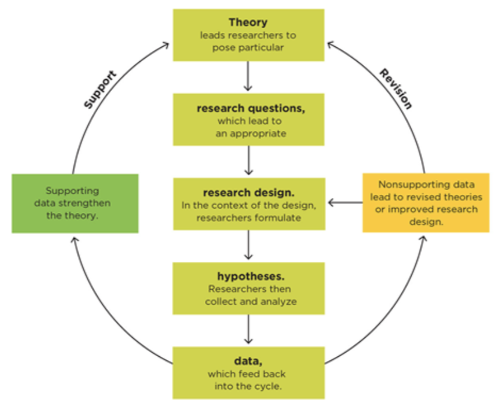

```{r child = "setup.Rmd"}
```


```{r packages, echo=FALSE, message=FALSE, warning=FALSE}
library(tidyverse)
library(emo)
xaringanExtra::use_scribble()
# highlightStyle: solarized-dark

library(viridis)
library(sugrrants)
library(lubridate)
```

## Why the Producer Role Is Important

--

- For coursework in psychology

--

- For college and graduate school

--

- For working in a research lab

---

## Why the Consumer Role Is Important

--

- For psychology courses

--

- When reading printed or online news stories based on research

--

- For your future career

--
  - Evidence-based treatments

---

## How Scientists Approach Their Work

Scientists are empiricists

--

Scientists test theories: the theory-data cycle

--

Scientists tackle applied and basic problems

--

Scientists dig deeper

--

Scientists make it public: the publication process

--

Scientists talk to the world: from journal to journalism

---

## Scientists Are Empiricists

**Empiricism** (aka the empirical method or empirical research)

---

## Scientists Test Theories: The Theory-Data Cycle

```{r echo=FALSE}

```

---

## Scientists Test Theories: The Theory-Data Cycle

**Good scientific theories:**  

--

Supported by data

--

Falsifiable

--

Have parsimony

--

Don't prove anything (weight of the evidence)

---

## Scientists Tackle Applied and Basic Problems

**Applied research:** conducted in order to solve practical problems; the word applied means that the findings will be directly applied to finding a solution to a real-world problem. 

--

*Example:* conducting a study to determine the best method for teaching young children how to read.

--

**Basic research:** The goal is to enhance the general body of knowledge about a particular topic. 

--

*Example:* conducting a study to investigate what 9-month-old infants can remember about hidden objects. Basic research can often be a foundation for later applied studies.

---

## SOURCES OF INFORMATION

---

## RESEARCH VS YOUR EXPERIENCE

---

## Experience Has No Comparison Group

Compared to what?

--

Need a **comparison group**

---

## Experience Is Confounded

**Confounds** are alternative explanations

--

What can we do about confounds?

---

## Claims That Lack Confidence

**Wearing kinesiotape helps my knee feel better when I run.**

--

*Ask one or more comparison group questions that would help you evaluate the conclusion.*

--

**Compared to what?** No tape

---

## Claims That Lack Confidence

**Wearing kinesiotape helps my knee feel better when I run.**

Draw a matrix for systematically comparing outcomes.

|Outcome| Hypothesized Group: Wearing Tape| Comparison Group: No Tape |
|------|------|------|
|Feel Better| x | x |
|Feel Worse| x | x |

---

## Claims That Lack Confidence

**Wearing kinesiotape helps my knee feel better when I run.**

*Write down as many possible confounds as you can think of.*

--

Taking pain medication, shoe type/support, running on cement/grass/field, taking it easier

---

## WAYS THAT INTUITION IS BIASED

---

## Being swayed by a good story

Sometimes we accept a conclusion because it sounds good or it makes sense, even if that good story is false. 

--

Example: To many people, bottling up negative emotions seems unhealthy and expressing anger seems sensible. However, the research does not support this.

---

## Being persuaded by what easily comes to mind

The **availability heuristic** states that things that come to mind easily are more “available” to memory and can guide and/or bias our thinking. This is especially true of memories that are recent or vivid.

--

Example: We might think shark attacks are common, but in fact they are extremely rare. Being killed by a shark (1 in 3.7 million) is less likely than dying in a bathtub (1 in 800,000). But death by shark attack is more memorable and vivid than dying in a bathtub, so people talk about it more. It comes to mind more easily and we inflate the associated risk.

---

## Failing to think about what we cannot see

The **present/present bias** states that we notice what is present and thus fail to look for absences. 

--

Example: Kinesiotape making knee feel better

---

## Focusing on the evidence we like best

The tendency to look only at information that agrees with what we already believe is called **confirmation bias**. 

--

We “cherry-pick” the information we take in—seeking and accepting only the evidence that supports what we already think. 

---

## The Intuitive Thinker vs. the Scientific Reasoner

We make mistakes when we base our reasoning on intuition rather than on science.

--

By thinking scientifically instead of intuitively, we can eliminate or reduce our cognitive and motivational biases. We do this by reasoning systematically and empirically, like researchers do.

--

Instead of only examining information that comes to mind easily or the parts that sound good, scientists look at all of the data and try to be as objective as possible. 

