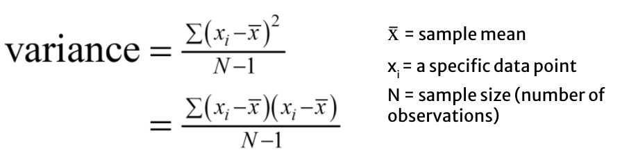
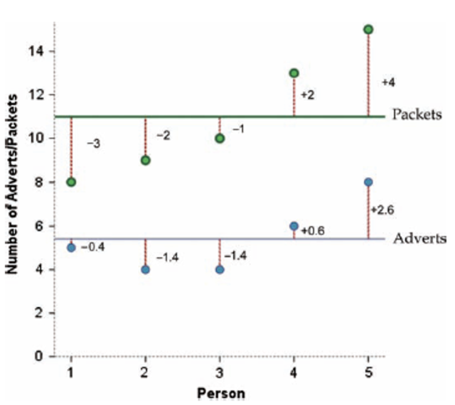
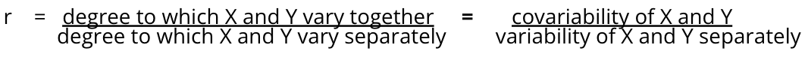
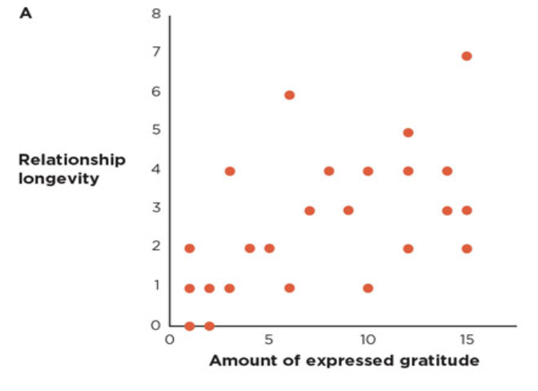
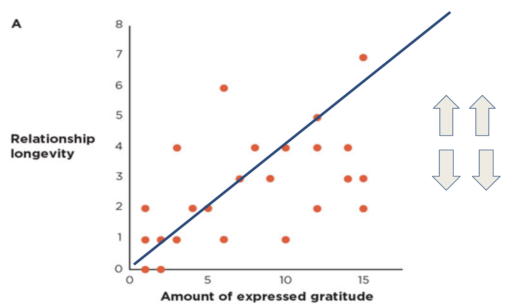
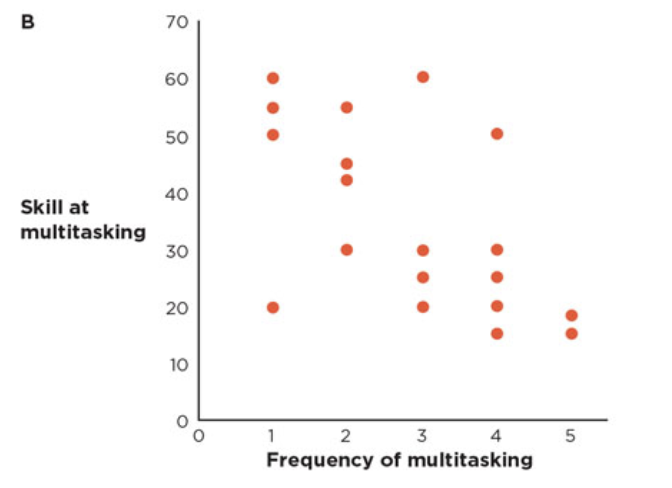
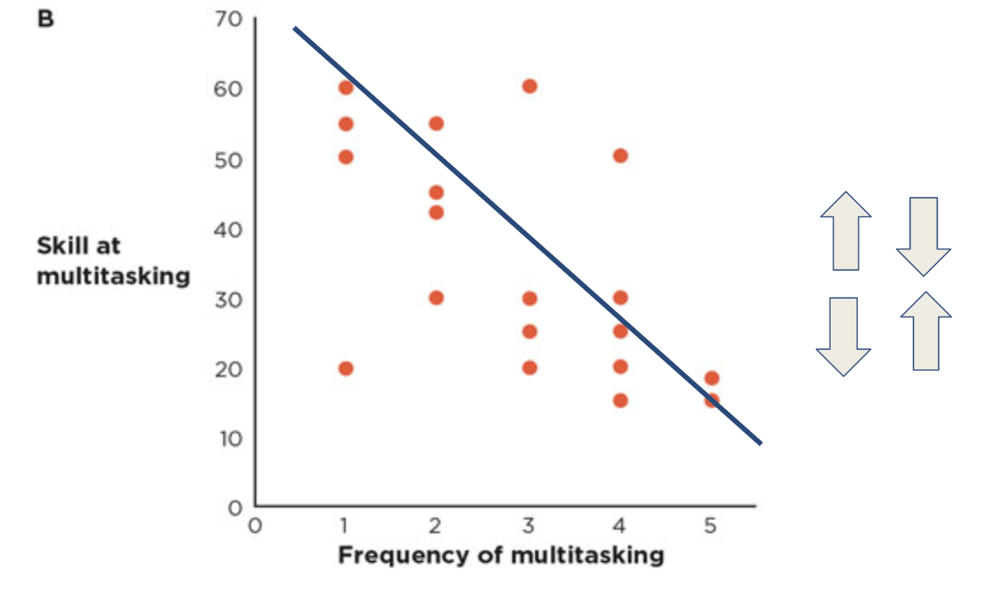
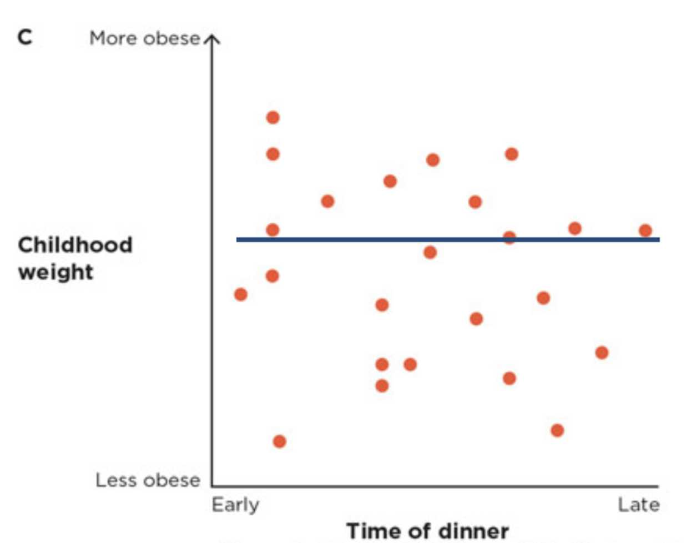

```{r child = "setup.Rmd"}
```


```{r packages, echo=FALSE, message=FALSE, warning=FALSE}
library(tidyverse)
library(emo)
xaringanExtra::use_scribble()
# highlightStyle: solarized-dark

```


class: middle

# How do we measure relationships?

---

## How do we measure relationships?

- The simplest way to look at whether two variables are associated is to see if they covary

- To understand covariance, we first need to understand variance

---

## Variance

The variance tells us by how much scores deviate from the mean for a single variable

```{r echo=FALSE, out.width="100%"}

```

---

## Covariance

- If we are interested in whether 2 variables are related, then we are interested in whether changes in one variable are met with similar changes in the other variable

- When one variable deviates from its mean, we would expect the other variable to deviate from its mean in a similar way

---

## Covariance

```{r echo=FALSE, out.width="50%"}

```

---

## Problems with Covariance

It depends upon the units of measurement

- e.g. the covariance of two variables measured in miles might be 4.25, but if the same scores are converted to kilometres, the covariance is 11

---

## Problems with Covariance

- One solution: standardize it! (Divide by the standard deviations of both variables)

- The standardized version of covariance is known as the correlation coefficient

- It is relatively unaffected by units of measurement.

---

## R<sup>2</sup>

- Pearson’s correlation coefficient is r

- Coefficient of determination is r<sup>2</sup>

- By squaring the value of r you get the proportion of variance in one variable shared by the other

---

## What is a Correlation?

- It is a way of measuring the extent to which two variables are related

- It measures the pattern of responses across variables

---

## What is a Correlation?

```{r echo=FALSE, out.width="100%"}

```

- That's what it means conceptually, but what exactly does that mean?

- To **covary** means that as X changes, Y also changes.

- Remember that a "perfect correlation" is r = 1.0 (or -1.0). 

---

## What is a Correlation?

```{r echo=FALSE, out.width="100%"}

```

- This means that the number in the numerator equals the number in the denominator. 

- On the bottom, we have two things, how much does X change and how much does Y change. 

- On the top we have, how much to X and Y change together. If these three parts add up to the same thing, then we have and r = 1.0.

---

## Correlation = Association

**Association:** Two Variables that are related

Argues that one level of a variable is likely to be associated with a particular level of another variable. Must involve at least two measured variables. Correlation (does not imply causation)

- People with Higher Incomes Spend Less Time Socializing
- Romantic Partners Who Express Gratitude Are Three Times More Likely to Stay Together
- People Who Multitask the Most Are the Worst at It

---

## Positive Correlation

```{r echo=FALSE, out.width="60%"}

```

---

## Positive Correlation

```{r echo=FALSE, out.width="70%"}

```

---

## Negative Correlation

```{r echo=FALSE, out.width="60%"}

```

---

## Negative Correlation

```{r echo=FALSE, out.width="70%"}

```

---

## Zero Correlation

```{r echo=FALSE, out.width="60%"}

```

---

## Making Predictions Based on Correlations

- Some correlational claims are useful because they help us make predictions.

- The stronger the association between the two variables, the more accurate the prediction will be.

- Both positive and negative associations can help us make predictions, but zero associations cannot. 

---

## Things to know about Correlation

It varies between -1 and +1

0 = no relationship

The sign tells us **direction**, not **magnitude**
 

---

## Things to know about Correlation

**It is an effect size:**

±.1 = small effect

±.3 = medium effect

±.5 = large effect

---

## Correlation and Causality

**The third-variable problem:** In any correlation, causality between two variables cannot be assumed because there may be other measured or unmeasured variables affecting the results

**Direction of causality:** Correlation coefficients say nothing about which variable causes the other to change, correlation does not imply causation

---

## How to Run Correlations in R

```{r, eval = F}
library(psych)
corr.test()
```

---

## Age & Parrots: Correlation

```{r, warning = F, message = F}
library(psych)
library(yarrr)
age.parrots.ctest <- corr.test(pirates$age, pirates$parrots)
age.parrots.ctest
```

Looks like we have a positive correlation of 0.19 and a very small p-value.

---

## Age & Parrots: Correlation

To see what information we can extract for this test, let’s run the command `names()` on the correlation object:

```{r}
names(age.parrots.ctest)
```

Looks like we’ve got a lot of information in this test object. As an example, let’s look at the adjusted confidence interval for the population correlation coefficient:

```{r}
age.parrots.ctest$ci.adj
```


---

## Visualizing Age & Parrots

```{r, warning = F, message = F}
ggplot(pirates, aes(age, parrots)) +
  geom_point(alpha = .5) + stat_smooth(method = "lm") + 
  labs(x = "Age", y = "Parrots") + theme_minimal()
```

---

## Corrgram

```{r, warning = F, message = F}
library(corrgram)
pirates %>%
  select(age, parrots, tattoos) %>%
  corrgram(diag=panel.density, lower.panel=panel.pts, upper.panel=panel.conf, cex=0.75)
```

---

## Corrplot

```{r, warning = F, message = F}
library(corrplot)
p.matrix <- pirates %>%
  select(age, weight, beard.length, tchests, parrots, 
         tattoos, sword.time, eyepatch, grogg) %>%
  cor()
```

---

## Corrplot

```{r, warning = F, message = F}
p.matrix
```

---

## Circle Corrplot

```{r, warning = F, message = F}
corrplot(p.matrix, method = "circle")
```

---

## Color Corrplot

```{r, warning = F, message = F}
corrplot(p.matrix, method = "color")
```

---

## Number Corrplot

```{r, warning = F, message = F}
corrplot(p.matrix, method = "number")
```

---

## Types of correlogram layout

**There are three types of layout:**

“full” (default) : display full correlation matrix

“upper”: display upper triangular of the correlation matrix

“lower”: display lower triangular of the correlation matrix

---

## Upper Corrplot

```{r, warning = F, message = F}
corrplot(p.matrix, type = "upper")
```

---

## Lower Corrplot

```{r, warning = F, message = F}
corrplot(p.matrix, type = "lower")
```

---


## Different Colors Corrplot

```{r, warning = F, message = F}
col.pal <- colorRampPalette(c("orange", "white", "purple"))(20)
col.pal
```

---

## Different Colors Corrplot

```{r, warning = F, message = F}
corrplot(p.matrix, type = "upper", col = col.pal, tl.cex = .8)
```

---

## Different Color & Rotation Corrplot

```{r, warning = F, message = F}
corrplot(p.matrix, type = "upper", col = col.pal, tl.cex = .8, tl.col="black", tl.srt=45)
```

---

## Computing the p-value of correlations. To compute the matrix of p-value, a custom R function is used :

```{r, warning = F, message = F}
cor.mtest <- function(mat, ...) {
    mat <- as.matrix(mat)
    n <- ncol(mat)
    p.mat<- matrix(NA, n, n)
    diag(p.mat) <- 0
    for (i in 1:(n - 1)) {
        for (j in (i + 1):n) {
            tmp <- cor.test(mat[, i], mat[, j], ...)
            p.mat[i, j] <- p.mat[j, i] <- tmp$p.value
        }
    }
  colnames(p.mat) <- rownames(p.mat) <- colnames(mat)
  p.mat
}
```

---

## Computing the p-value of correlations. To compute the matrix of p-value, a custom R function is used :

```{r, warning = F, message = F}
pirate.p <- cor.mtest(p.matrix)
pirate.p
```

---

## Add significance level to the correlogram

```{r}
corrplot(p.matrix, type="upper", p.mat = pirate.p, sig.level = 0.05)
```

---

## Add significance level to the correlogram

```{r}
corrplot(p.matrix, type="upper", p.mat = pirate.p, sig.level = 0.05, 
         insig = "blank")
```

---

```{r, eval = F}
col.pal <- colorRampPalette(c("#BB4444", "#EE9988", "#FFFFFF", "#77AADD", "#4477AA"))
corrplot(p.matrix, method="color", col=col.pal(200),  
         type="upper", 
         addCoef.col = "black", # Add coefficient of correlation
         tl.col="black", tl.srt=45, #Text label color and rotation
         # Combine with significance
         p.mat = pirate.p, sig.level = 0.05, insig = "pch", 
         # hide correlation coefficient on the principal diagonal
         diag=FALSE 
         )
```

---

```{r, echo = F}
col.pal <- colorRampPalette(c("#BB4444", "#EE9988", "#FFFFFF", "#77AADD", "#4477AA"))
corrplot(p.matrix, method="color", col=col.pal(200),  
         type="upper", 
         addCoef.col = "black", # Add coefficient of correlation
         tl.col="black", tl.srt=45, #Text label color and rotation
         # Combine with significance
         p.mat = pirate.p, sig.level = 0.05, insig = "pch", 
         # hide correlation coefficient on the principal diagonal
         diag=FALSE 
         )
```
