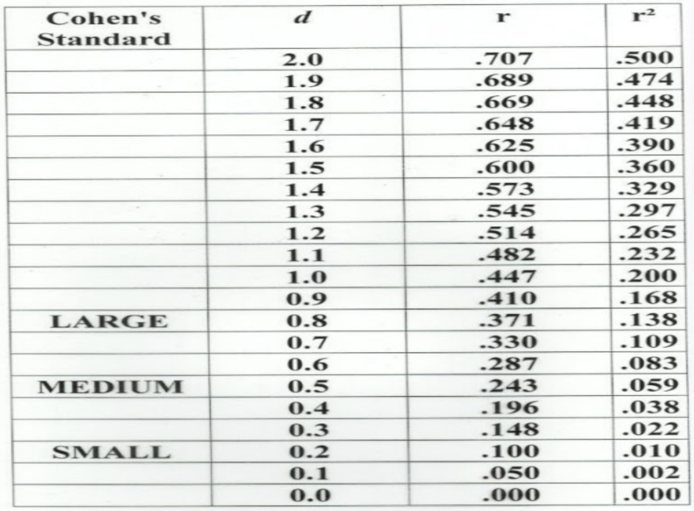

```{r child = "setup.Rmd"}
```


```{r packages, echo=FALSE, message=FALSE, warning=FALSE}
library(tidyverse)
library(emo)
xaringanExtra::use_scribble()
# highlightStyle: solarized-dark
#remotes::install_github("profandyfield/discovr")
#library(discovr)

spiderdata <- read.csv("data/spiderdata.csv")
```


class: middle

# What is the purpose of a t-test?

---

## Looking at Differences

Researchers are sometimes interested in looking at differences *between* groups of people. 

In particular, in experimental research we often want to manipulate what happens to people so that we can make causal
inferences. 

---

## Looking at Differences

For example, let’s say we take two groups of people and randomly assign one group a program of dieting pills and the other group a program of sugar pills (which they think will help them lose weight).

Then, if the people who take the dieting pills lose more weight than those on the sugar pills we can infer that the diet pills caused the weight loss.

---

## T-Tests

- This is a powerful research tool because it goes one step beyond merely observing variables and looking for relationships (as in correlation ).

- T-Tests handle the simplest scenario: when we have two groups, or, to be more specific, when we want to compare two means.

---

## T-Tests

The simplest form of experiment that can be done is one with only one independent variable that is manipulated in only two ways and only one outcome is measured.

- More often than not, the manipulation of the independent variable involves having an experimental condition and a control.

- Example: Is the movie Scream 2 scarier than the original Scream? We could measure heart rates (which indicate anxiety) during both films and compare them.

This situation can be analyzed with a t-test.

---

## Rationale for T-Tests

- Two samples of data are collected and the sample means are calculated. These means might differ by either a little or a lot.

- If the samples come from the same population, then we expect their means to be roughly equal. Although it is possible for means to differ by chance alone, we would expect large differences between sample means to occur very infrequently.

- We compare the difference between the sample means that we collected to the difference between the sample means that we would expect to obtain if there were no effect (i.e. if the null hypothesis were true). We use the standard error as a gauge of the variability between sample means.

---

## Rationale for T-Tests

If the difference between the samples we have collected is larger than what we would expect based on the standard error then we can assume one of two things:

- There is no effect and sample means in our population fluctuate a lot and we have, by chance, collected two samples that are atypical of the population from which they came.

- The two samples come from different populations but are typical of their respective parent population. In this scenario, the difference between samples represents a genuine difference between the samples (and so the null hypothesis is incorrect).

---

## Rationale for T-Tests

As the observed difference between the sample means gets larger, the more confident we become that the second explanation is correct (i.e. that the null hypothesis should be rejected). 

If the null hypothesis is incorrect, then we gain confidence that the two sample means differ because of the different experimental manipulation imposed on each sample.

```{r echo=FALSE, out.width="100%"}

```

---

## T-Test Types

There are two different t-tests and it depends on whether the IV  was manipulated using the same participants or different:

- **Independent t-test:** This test is used when there are two experimental conditions and different participants were assigned to each condition 

- **Dependent t-test:** This test is used when there are two experimental conditions and the same participants took part in both conditions of the experiment

---

## Assumptions for T-Tests

Both the independent and the dependent t-test assume:

- The sampling distribution is normally distributed. In the dependent t test this means that the sampling distribution of the differences between scores should be normal, not the scores themselves.

- Data are measured at least at the interval level.

The independent t-test, because it is used to test different groups of people, also assumes:

- Variances in these populations are roughly equal (homogeneity of variance).

- Scores in different treatment conditions are independent (because they come from different people).

---

## T-Test Example: What type of t-test is this?


**Is arachnophobia (fear of spiders) specific to real spiders or is a picture enough?**

Participants

- 24 arachnophobic individuals

Manipulation (IV) with 2 levels:

- 12 participants were exposed to a real spider

- 12 were exposed to a picture of the same spider

Outcome (DV)

- Anxiety

---

## T-Test Example in R

To do a t-test we use the function *t.test()*

It follows the following format:

```{r, eval = F}
t.test(outcome ~ predictor, data = dataFrame, paired = FALSE)
```

**OR**

```{r, eval = F}
t.test(dataset$vector1, dataset$vector2, paired = TRUE)
```

---


## Independent T-Test Example in R

```{r}
t.test(anxiety ~ spider_type, spiderdata)
```

---

## Reporting the Results:

On average, participants experienced greater anxiety from real spiders (*M* = 47, *SE* = 3.18), than from pictures of real spiders (*M* = 40, *SE* = 2.68).

This difference was not significant, t(21.4) = -1.68, p > 0.05; however, it did represent a medium-sized effect, r = 0.34.

---

## Visualizing T-Test Example in R

```{r, eval = FALSE}
library(viridis)
ggplot(spiderdata, aes(spider_type, anxiety, fill = spider_type)) + stat_summary(fun = "mean", geom = "bar") +
  scale_fill_viridis(discrete = TRUE, option = "mako") +
  theme_minimal() +
  guides(fill = "none") +
  labs(y = "Anxiety", x = "Spider Type", title = "Anxiety x Type of Spider")
```

---

## Visualizing T-Test Example in R

```{r, echo = FALSE}
library(viridis)
ggplot(spiderdata, aes(spider_type, anxiety, fill = spider_type)) + stat_summary(fun = "mean", geom = "bar") +
  scale_fill_viridis(discrete = TRUE, option = "mako") +
  theme_minimal() +
  guides(fill = "none") +
  labs(y = "Anxiety", x = "Spider Type", title = "Anxiety x Type of Spider")
```

---

## T-Test Example: What type of t-test is this?


**Is arachnophobia (fear of spiders) specific to real spiders or is a picture enough?**

Participants

- 12 arachnophobic individuals

Manipulation (IV) with 2 levels:

- Each participant was exposed to a real spider and a picture of the same spider at two points in time (SAME people).

Outcome (DV)

- Anxiety

---

## Dependent T-Test Example in R

```{r}
t.test(anxiety ~ spider_type, paired = TRUE, spiderdata)
```

---

## Reporting the Results:

On average, participants experienced significantly greater anxiety from real spiders (*M* = 47, *SE* = 3.18), than from pictures of spiders (*M* = 40, *SE* = 2.68).

This difference is significant, t(11) = 2.47, p < 0.05; however, it did represent a medium-sized effect, r = 0.6.

---

## Important note on p values

- A p value of < 0.05 is our (somewhat arbitrary) cut off for statistical significance 

- When a p value is < 0.05 we say it is statistically significant

- ...but

---

## Important note on p values

- The American Statistical Association put out the statement clarifying the p value because “The p-value was never intended to be a substitute for scientific reasoning.” 

- Overemphasis on p value often leads to the neglect of other information in studies such as **effect size**. 

---

## Important note on p values

Although p-values are helpful in assessing how incompatible the data are with a specified statistical model, other factors like the design of a study, the quality of the measurements, the external evidence for the phenomenon under study, and the validity of assumptions should be managed. 

---

## Important note on p values

The p-value is easily misinterpreted. 

For example, it is often equated with the strength of a relationship, **but a tiny effect size can have very low p-values with a large enough sample size.**

---

## Important note on p values

**A tiny effect size can have very low p-values with a large enough sample size.**

The p value is highly influenced by sample size: If your sample is too small you will likely not be able to detect a true effect (type 2 error). On the flip side, if you sample size is huge you are far more likely to find a significant result even when the true effect is small or negligent (type 1 error). 

---

## Important note on p values

**A tiny effect size can have very low p-values with a large enough sample size.**

This is why effect sizes are important as they are not influenced by huge sample sizes (i.e. a large sample does not mean you will have a large effect size)

For the t-test, the most commonly reported effect size is Cohen’s d

---

## Effect Sizes in English

If an effect is large, you should be able to observe the effect even with a relatively small sample

Example: Distinguishing sex in sea lions 

```{r echo=FALSE, out.width="50%"}

```

---

## Effect Sizes in English

If an effect is small, you'd need a big sample size to detect it.

Example: Distinguishing sex in pugs 

```{r echo=FALSE, out.width="50%"}

```

---

## Cohen's d

**Cohen (1988)** defines the effect size as the extent to which the phenomenon is found within the population or, in the context of statistical significance testing, the degree to which the null hypothesis is false

The extent to which the DV can be controlled, predicted, and explained by the IV(s) (Snyder & Lawson, 1993)

---

## Cohen's d

```{r echo=FALSE, out.width="60%"}

```

---

## Cohen's d

```{r echo=FALSE, out.width="65%"}

```

---

## Cohen's d in R

**cohen.d(data$DV, data$IV)**

```{r, message = F, warning = F}
library(palmerpenguins)
library(psych)
cohen.d(penguins$body_mass_g, penguins$sex)
```

