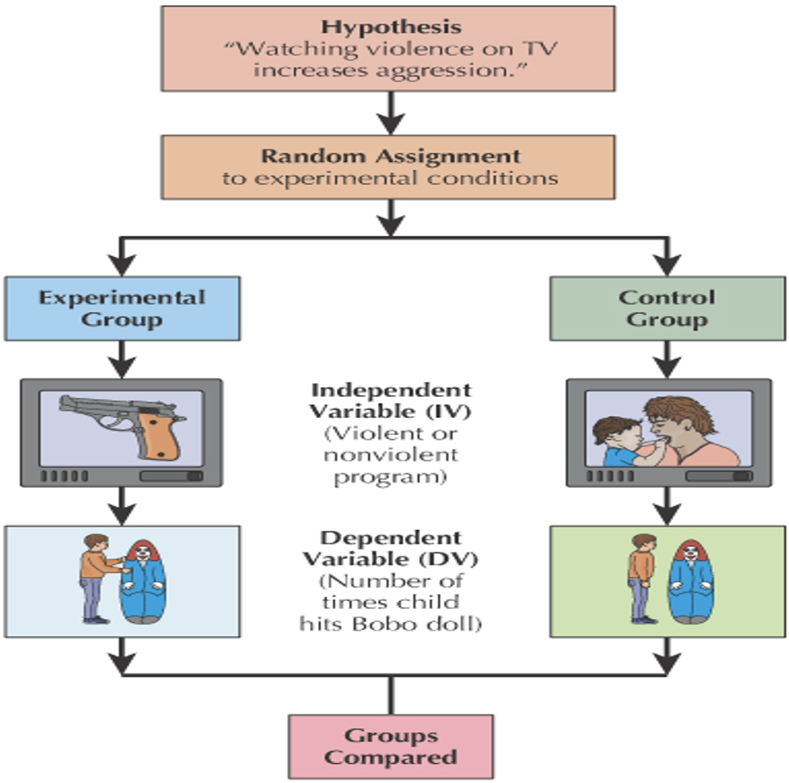
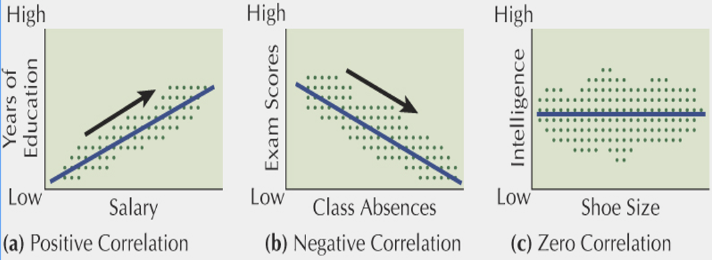
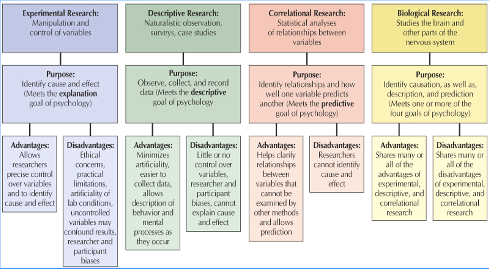

```{r child = "setup.Rmd"}
```


```{r packages, echo=FALSE, message=FALSE, warning=FALSE}
library(tidyverse)
library(emo)
xaringanExtra::use_scribble()
# highlightStyle: solarized-dark

library(tidymodels)
library(DT)
library(openintro)
```

class: middle

# Research Methods

---

## Four Methods

We know psychological research can only be basic, translational, or applied

There are 4 methods of research within psychology: 
- Experimental
- Descriptive 
- Correlational
- Biological 

---

## Experimental Research 

Experimental Research is the only method of the four that can identify cause and effect

Experimental research consists of several variables:

- **Independent Variables:** factors the experimenter manipulates 

- **Dependent Variables:** measurable behaviors of the participants 

- **Experimental controls:** include control condition - participants are treated identically to participants in experimental condition, except that the independent variable is not applied to them

---

## Experimental Research 

In the experimental condition: all participants are exposed to the independent variable

**Experimental Group:** group that receives a treatment in an experiment

**Control Group:** group that receives no treatment in an experiment

---


```{r echo=FALSE, out.width="52%"}

```

---

## Descriptive Research

Includes several types of studies to gather data

- **Naturalistic Observation** is used to study behavior in its natural habitat

- **Surveys** use tests, questionnaires, and interviews to sample a wide variety of behaviors and attitudes 

- **Case study** in-depth study of a single research participant

---

## Surveys

Psychologists conduct surveys by asking people to fill out written questionnaires or by interviewing people orally

- By interviewing people with direct questions psychologists can get information about people's attitudes and behaviors 

---

## Problems with Surveys

The findings of interviews and questionnaires may not be completely accurate because…

- People may not be honest about their attitudes or behavior

- People may limit their responses for privacy reasons

- People may say what they think the interviewers want to hear

---

## Correlational Research

- Allows scientists to determine the degree of relationship between variables 

- Positive, negative and zero correlations are discussed when using this type of research



---

## Correlational Research

Correlation is a major method within psychology 

It CANNOT show a Cause and Effect Relationship 

Just because two things are related does not mean one causes the other

---

## Biological Research

The scientific study of psychology 

Studies the brain and nervous system 

Tests used in biological research include:

- Electrical recordings of brain activity (EEG)

- Computed tomography (CT)

- Magnetic resonance imaging (MRI)


---

